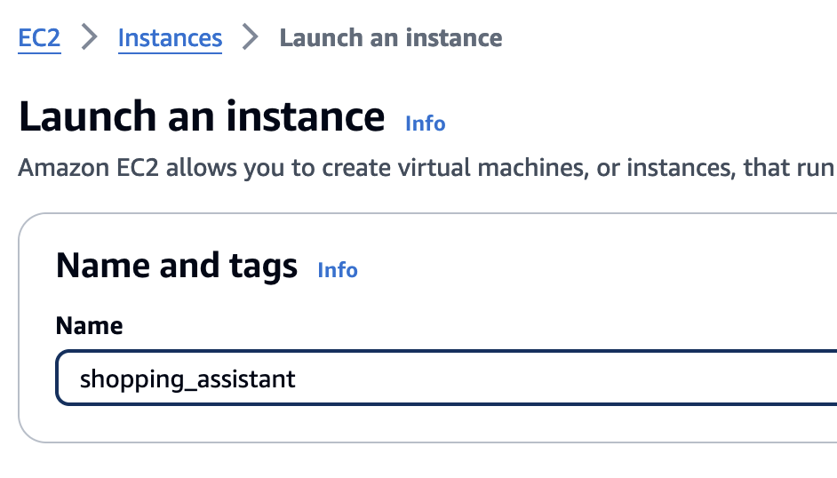

# Intelligent shopping assistant solution on AWS


## Introduction

A shopping assistant demo using Amazon Bedrock, Amazon OpenSearch with product search and recommendation technique.


*Reference Architecture on AWS*


*Design Logic*


## Overview

This guidance describes how to build intelligent shopping guide by combining LLM with the process of pre-sales marketing to generate scenario-based and personalize marketing words, and complete accurate product recommendations, then improving pre-sales marketing efficiency and business conversion.
It offers the following key features:
- Guide customer communication around product attributes and explore user needs.
- Product search based on user intention, including text, vector and self-query search types.
- Product recommendation based on Amazon Personalize services.
- Personalize your product marketing copy using large language model.
- Call the internal system of the e-commerce platform through function call to realize functions such as adding to shopping cart and querying orders.
- Identify products in pictures through large language models and make purchases based on the products in pictures.
- Provides a dialogue interface and a product data upload interface.


## Prerequisites

### Operating System
CDK are optimized to best work to be initiated on **<Amazon Linux 2023 AMI>**.  Deployment in another OS may require additional steps.

### AWS account requirements

- IAM role with specific permissions
- Amazon Bedrock
- Amazon Lambda
- Amazon DynamoDB
- Amazon OpenSearch Service
- Amazon Personalize
- Amazon SageMaker (Optional, if you need customized models to be deployed)
- Amazon Secrets Manager

### Supported Regions

us-west-2, us-east-2, us-east-1, ap-south-1, ap-southeast-1, ap-southeast-2, ap-northeast-1, eu-central-1, eu-west-1, eu-west-3, or any other region that supports the services (bedrock) used in the Guidance.

## Deployment Steps

### 0.Launch EC2 instance

(1)	input a name of EC2



(2)	Instance type select t3.large

(3)	Create new Key pair

(4)	In the Network setting, select ‘Allow HTTP traffic from the internet’


(5)	In the configure storge, input ‘20’ GiB


(6)	In the Advanced details, click ‘Create new IAM profile’

    a.In the IAM Role page, click Create role
    
    b.In the Select trusted entity page, select EC2 in the Use case and click next
    
    c.Select role:
        
        •	AmazonS3FullAccess
        
        Create the role
        
    d.Select the role in the IAM instance profile
    
(7)	Launch the EC2 and Connect the EC2


(8) download the code from git

```
sudo yum update
sudo yum install git
git clone https://github.com/aws-samples/intelligent-shopping-assistant.git
```

### 1. Lambda and OpenSearch deployment

Deploy resources with reference to ./deployment/Resource_deployment_README.md


### 2. model deployment

In the Amazon SageMaker -> Notebook instances -> ShoppingGuideNotebook -> intelligent_shopping_assistant/model

* open /reranking_model/bge_m3_reranker_deploy.ipynb to deploy the reranker model

* open /text_embedding_Model/bge_m3_deploy.ipynb to deploy the text embedding model

* 【Optional】open image_embedding_model/deploy-clip-image-embedding.ipynb to deploy the image embedding model


### 3. WebUI deployment

Deploy webUI with reference to ./web_ui/UI_deployment_README.md


### 4. data load

Choose one of the following two methods

#### offline data load

In the Amazon SageMaker -> Notebook instances -> ShoppingGuideNotebook -> intelligent_shopping_assistant/data_load_offline

* open /opensearch/data_load_csv.ipynb to load the product information with csv format

#### online data load

In the the web ui page, open data_load page to load data. 


## Security

See [CONTRIBUTING](CONTRIBUTING.md#security-issue-notifications) for more information.

## License

This library is licensed under the MIT-0 License. See the LICENSE file.

