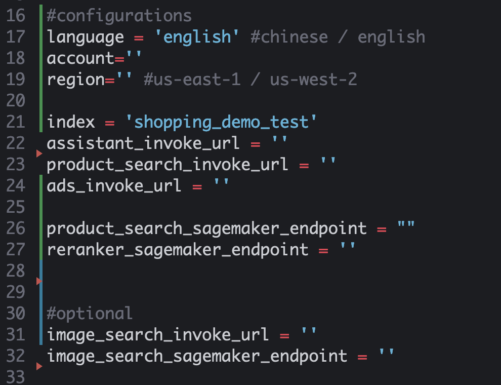
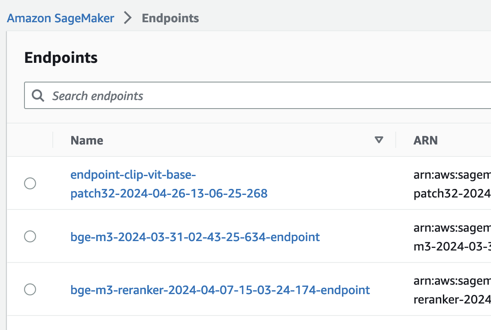

# Deploy streamlit in EC2

### 1.Create EC2 instance

Network settings choose "Allow HTTP traffic from the internet"

### 2.Connect to EC2, install the following dependencies:

```
sudo yum update
sudo yum install nginx
sudo yum install tmux -y
sudo yum install python3-pip
pip install streamlit
```

### 3.Create nginx profiles

```
cd /etc/nginx/conf.d
sudo touch streamlit.conf
sudo chmod 777 streamlit.conf
vi streamlit.conf
```

enter the template:

```
upstream ws-backend {
        server xxx.xxx.xxx.xxx:8501;
}

server {
    listen 80;
    server_name xxx.xxx.xxx.xxx;
    client_max_body_size 100m;

    location / {
            
    proxy_pass http://ws-backend;

    proxy_set_header X-Forwarded-For $proxy_add_x_forwarded_for;
      proxy_set_header Host $http_host;
      proxy_redirect off;
      proxy_http_version 1.1;
      proxy_set_header Upgrade $http_upgrade;
      proxy_set_header Connection "upgrade";
    }
  }
```

Change the xxx.xxx.xxx.xxx to the EC2 private IP.


### 4. start nginx

```
sudo systemctl start nginx.service
```


### 5.configure the invoke url

Open the /home/ec2-user/intelligent-shopping-assistant/web_ui/pages/Assistant.py,Fill in the following parameters:



(1) copy the index name to the 'index' parameters

(2) copy the assistant invoke url from api gateway


paste the invoke url to the 'assistant_invoke_url' parameters

(3) copy the product search invoke url from api gateway


paste the invoke url to the 'product_search_invoke_url' parameters

(4) copy the ads invoke url from api gateway


paste the invoke url to the 'ads_invoke_url' parameters

(5) in the Sagemaker->Inference->Endpoints



copy the 'bge-m3-xxx' to 'product_search_sagemaker_endpoint' parameters

copy the 'bge-m3-reranker' to 'reranker_sagemaker_endpoint' parameters

(5) [optional] copy the data load invoke url from api gateway


paste the invoke url to the webpage api url input box


### 6.Run streamlit ui stript

```
cd /home/ec2-user/intelligent-shopping-assistant/web_ui
tmux
streamlit run shopping_assistant_demo.py
```

### 7.Open ui page

Enter the url in the webpage：http://EC2 public IP